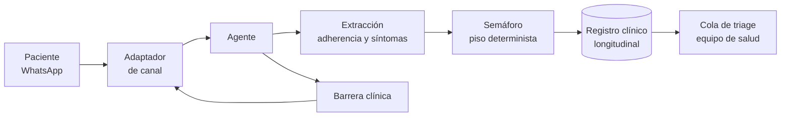

# PreventIA

**Acompañante geriátrico de adherencia.** Seguimiento diario por WhatsApp a adultos mayores
polimedicados: verifica la toma de medicamentos, detecta descompensación temprana y escala al equipo
de salud solo cuando hay una señal real de alarma.

---

## El problema

Más de dos millones de personas esperan una primera consulta de especialidad en el sistema público:
2.088.245 al 31 de marzo de 2026, con una mediana de 236 días. Para un adulto mayor que ya está en
control, el problema no es la fila.

El Programa de Salud Cardiovascular tiene bajo control a 2,3 millones de personas, y el 65% de ellas
vive con más de una enfermedad crónica. Las garantías GES cubren la entrada: 45 días para confirmar
una hipertensión, 24 horas para iniciar el tratamiento. Ninguna cubre el intervalo. Una vez
compensado el paciente, el programa sugiere un control cada 3 meses si el riesgo cardiovascular es
alto, cada 6 si es moderado, cada 6 a 12 si es bajo. La insuficiencia cardíaca no es siquiera un
problema GES: no tiene plazo garantizado de ninguna clase.

En ese intervalo sí hay alguien mirando, y ahí está el costo. Los equipos municipales de atención
primaria están obligados a rescatar a quien falta a su control, con al menos tres intentos
documentados antes de poder darlo de baja. Nueve de cada diez de los 2.027 establecimientos que
hacen ese trabajo dependen de un municipio. Aun así, una descompensación que empezó a insinuarse
tres semanas antes llega a urgencias como si hubiera aparecido de golpe.

Cifras: Glosa 06 del Minsal (I trimestre 2026), Orientación Técnica del PSCV y evaluación DIPRES del
Fondo de Farmacia. Fuentes y método en [docs/research/](docs/research/).

## Qué hace

PreventIA conversa todos los días con el paciente por WhatsApp, en lenguaje natural. De esa
conversación extrae dos cosas: si las dosis se tomaron, y si aparecieron señales tempranas de
descompensación mencionadas al pasar, no como respuesta a un cuestionario.

Cada interacción queda clasificada en un semáforo de riesgo. Cuando hay una señal real de alarma, y
solo entonces, el caso escala al equipo de salud con el resumen longitudinal ya armado.

## El semáforo

El color se decide en dos pasos. Primero, una tabla determinista de banderas clínicas fija un color
**mínimo**. Después, el modelo puede **subirlo** si detecta algo que la tabla no anticipó.

**El modelo nunca puede bajar un color que las reglas fijaron.** Está garantizado en código, no en
una instrucción, y hay pruebas automatizadas que lo demuestran.

| Color | Qué significa | Qué pasa |
|-------|---------------|----------|
| Verde | Adherencia adecuada, sin señales | Se registra, no se molesta a nadie |
| Amarillo | Adherencia irregular o síntoma leve | Queda en la cola, sin urgencia |
| Rojo | Señal de alarma clínica | Escala de inmediato al equipo de salud |

## Lo que no hace, nunca

Esto no es una lista de precauciones. Es el límite que define el producto.

- **No diagnostica.** No nombra una condición ni explica qué significa clínicamente un síntoma.
- **No indica, cambia, suspende ni dosifica un tratamiento.** Pregunta si el medicamento se tomó; no
  dice qué tomar.
- **No reemplaza un control.** Opera entre controles y lo dice cuando se lo preguntan.
- **No cierra un caso.** Toda escalación termina en una persona.
- **No trabaja con datos reales de pacientes.** Cohorte sintética o datos anonimizados y agregados.

La barrera se sostiene en tres capas: la instrucción del sistema, un filtro determinista sobre cada
mensaje que sale, y una suite de pruebas adversariales que se puede correr delante de quien
pregunte.

## Stack

| Pieza | Elección | ADR |
|-------|----------|-----|
| Agente | Strands Agents SDK, capa de modelo agnóstica | [0001](docs/adr/0001-strands-agents-sdk-with-agnostic-provider.md), [0010](docs/adr/0010-claude-as-the-lab-runtime-ollama-as-the-deployment-path.md) |
| Modelo | Claude en el Lab; Ollama local como vía de despliegue | [0010](docs/adr/0010-claude-as-the-lab-runtime-ollama-as-the-deployment-path.md) |
| Registro clínico | SQLite | [0002](docs/adr/0002-sqlite-clinical-record-file-sessions.md) |
| Canal | WhatsApp Cloud API detrás de un adaptador | [0003](docs/adr/0003-whatsapp-cloud-api-behind-channel-adapter.md) |
| Clasificación | Piso determinista, escalamiento por modelo | [0004](docs/adr/0004-deterministic-floor-for-the-semaforo.md) |
| Barrera clínica | Instrucción, filtro y pruebas | [0005](docs/adr/0005-three-layer-clinical-guardrail.md) |
| Escalación | Cola de triage para el equipo de salud | [0006](docs/adr/0006-clinician-triage-queue-as-escalation-surface.md) |
| Datos | Cohorte sintética y adaptador | [0007](docs/adr/0007-synthetic-cohort-with-caja-adapter.md) |

## Documentación

| Documento | Qué contiene |
|-----------|--------------|
| [PRD.md](PRD.md) | Producto, alcance clínico, criterios del semáforo. En español |
| [ROADMAP.md](ROADMAP.md) | Fases, desde el trabajo pre-lab hasta la adopción |
| [docs/adr/](docs/adr/README.md) | Una decisión por archivo, inmutables una vez aceptadas |
| [CLAUDE.md](CLAUDE.md) | Contrato de trabajo del equipo, convenciones y runbook |
| [docs/research/](docs/research/) | Fundamento clínico y fuentes |

## Estado

Fase 0, trabajo previo al lab. Ver [ROADMAP.md](ROADMAP.md) para lo que está hecho y lo que
bloquea cada fase.

Dos cosas están abiertas y son requisito, no detalle: la tabla de banderas clínicas por condición,
que la escribe un profesional de salud y no un desarrollador, y el modelo local que se va a servir.

## Contexto

Construido para el **Claude Impact Lab Longevidad**, 5 y 6 de agosto de 2026, Parque La Florida,
Santiago. Organizan Anthropic y Bendita IA, con Caja La Araucana. Línea de impacto: continuidad y
medicina de precisión.

La medicina existe. La longevidad para todos, no.
